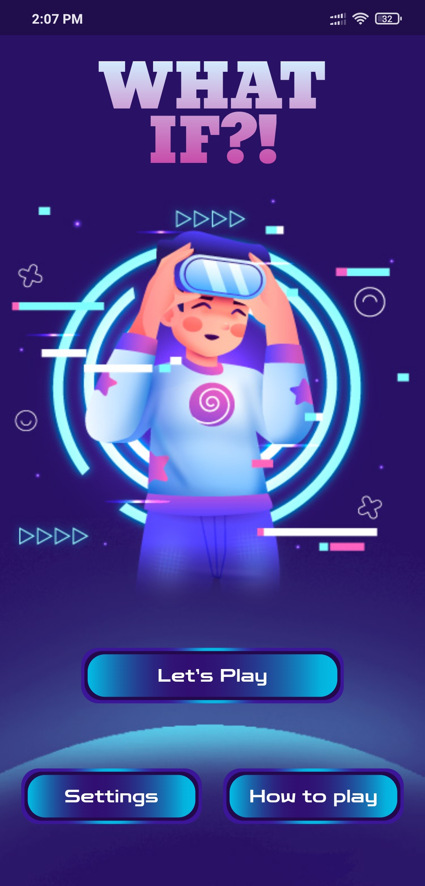
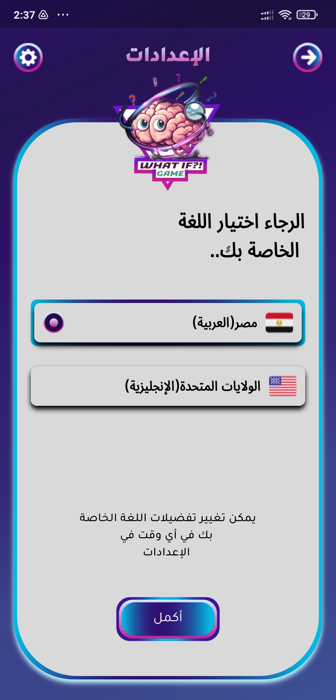
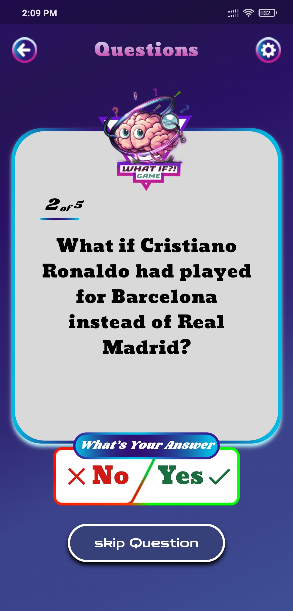
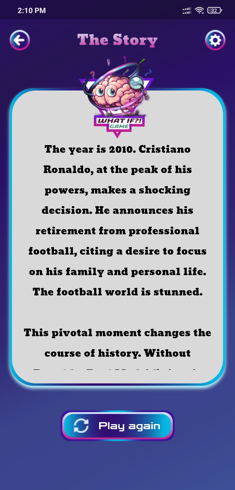

# What If?!

## Overview
**What If?!** is a unique and engaging game designed for imaginative thinkers who enjoy exploring alternative scenarios and pondering the impact of different decisions. The game allows players to delve into the "what if" moments of various categories like sports, movies, and TV shows, and craft their own stories based on hypothetical situations. Whether you're curious about how a different choice could have changed history or just looking for a fun way to spark your creativity, **What If?!** offers endless possibilities.

## Project Structure
- **`mobile-app/`**: Contains the Flutter code for the mobile application.
- **`back-end/`**: Contains the server-side code, including APIs and database management.
- **`front-end/`**: Contains the code for our website interface.

## Getting Started 
Each component has its own README file with detailed instructions for setup, installation, and running the project. Refer to the specific README files in each directory for more information:
- [Mobile App README](./mobile-app/README.md)
- [Back-End README](./back-end/README.md) 
- [Front-End README](./front-end/whatIf/README.md)

## Features
- **Diverse Categories**: Choose from a wide range of categories, including Football, Movies, and more.
- **Focused Scenarios**: Narrow down your interest by selecting a specific focus within each category.
- **Interactive Questions**: Answer five thought-provoking questions that guide you in creating an alternate reality.
- **AI-Generated Stories**: Let AI bring your imagination to life by generating a unique story based on your inputs.
- **Share with Friends**: Share your created stories with friends and discuss the potential outcomes of these alternate scenarios.
- **User-Friendly Interface**: Enjoy a clean and intuitive interface that makes the game easy to navigate and fun to play.

## How to Play

1. **Select a Category**: Begin by selecting a category that interests you. Categories include:
   - **Football**: Reimagine key moments in football history.
   - **Movies**: Rethink the events, outcomes, or character decisions in iconic films.
   
2. **Choose a Focus**: After selecting a category, specify your focus:
   - **For Football**: Focus on a specific Club or Player.
   - **For Movies**: Focus on a particular Movie.

3. **Answer Five Questions**: The game will present five carefully crafted "What If" questions related to your chosen focus. Your answers will help shape the alternate reality you wish to explore. For example:
   - "What if Cristiano Ronaldo had stayed at Manchester United instead of moving to Real Madrid?"
   - "What if Walter White had never turned to cooking meth in *Breaking Bad*?"

4. **Generate Your Story**: Once you’ve answered the questions, ask the AI to generate a story that reflects your alternate scenario. The AI will weave your inputs into a narrative that explores the consequences of these changes.

5. **Review and Share**: Review the generated story, and if you're satisfied, share it with your friends. Discuss the potential outcomes, debate the plausibility, and have fun imagining the ripple effects of these changes.

## Example Scenarios

### Football:
- **Scenario**: What if Lionel Messi had chosen to represent Spain instead of Argentina?
  - **Questions**: 
    1. What impact would this have had on the Spanish national team?
    2. Would Messi still be considered one of the greatest if he had not played for Argentina?
    3. How would this decision have affected his club career?
    4. What would have been the reaction in Argentina?
    5. Could Argentina have found another star to fill Messi’s shoes?
  - **Generated Story**: The AI would create a narrative exploring how Messi's decision altered his career, international tournaments, and the footballing world.

### Movies:
- **Scenario**: What if Harry Potter had been sorted into Slytherin instead of Gryffindor?
  - **Questions**:
    1. How would this have changed his relationships with other characters?
    2. Would Harry still have defeated Voldemort?
    3. How would his time at Hogwarts be different?
    4. Would he still have been friends with Ron and Hermione?
    5. What would be the impact on the Wizarding World?
  - **Generated Story**: The AI would generate a story that examines how Harry's time in Slytherin would have altered the series' major events and his destiny.

## Screenshots

To help you better understand how to play **What If?!**, here are some screenshots from the app:

### Home Screen

The main screen where you can select a category to begin your journey into alternate realities.

### Setting Screen

The Setting screen where you can change language between English or Arabic.

### Answering Questions

Example of the interface where you answer the five "What If" questions.

### Generated Story

An example of a story generated by the AI based on the user's inputs.

## UI/UX Team
Meet our talented UI/UX team:
 - **[Abdulrahman Fawzy](https://www.behance.net/abdulrhmanfawzy)** - UI/UX Designer
 - **[Malak Elbehairy](https://www.behance.net/55c64d4a)** - UI/UX Designer

## Installation

1. **Download**: Download the app from the [Download the App](https://www.mediafire.com/file/mh8lntfut23k19i/What-IF.apk/file).
2. **Install**: Follow the on-screen instructions to install the app on your device.
3. **Launch**: Open the app and start exploring endless "What If" scenarios.

## Conclusion

**What If?!** is more than just a game; it's a tool for creative exploration. Whether you're curious about how different decisions could have altered history or just looking to have fun with friends, this game provides a unique platform to explore those "what if" moments. Dive into the world of alternate realities and discover the power of imagination.
